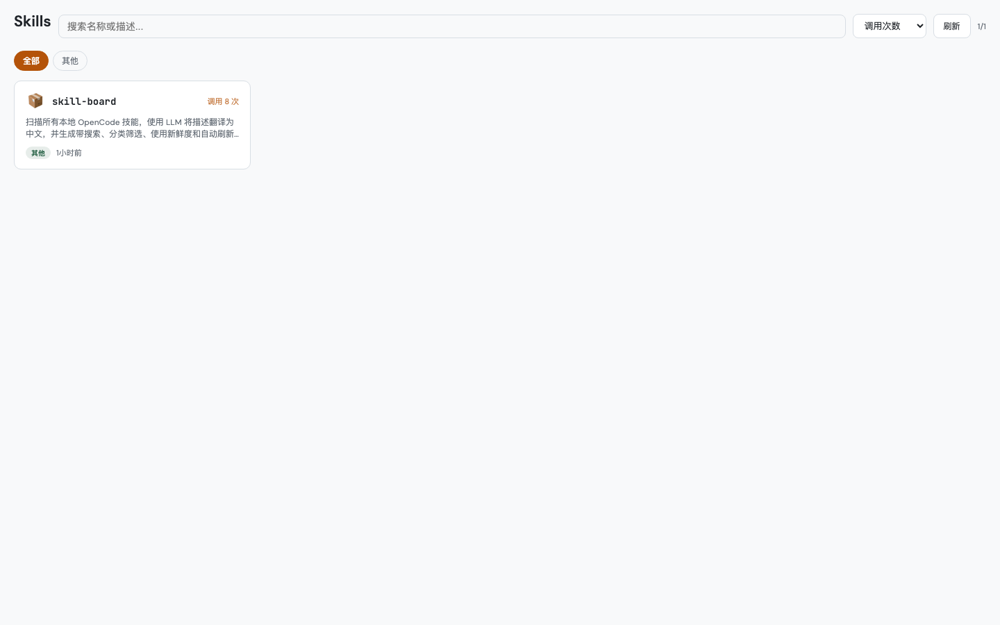
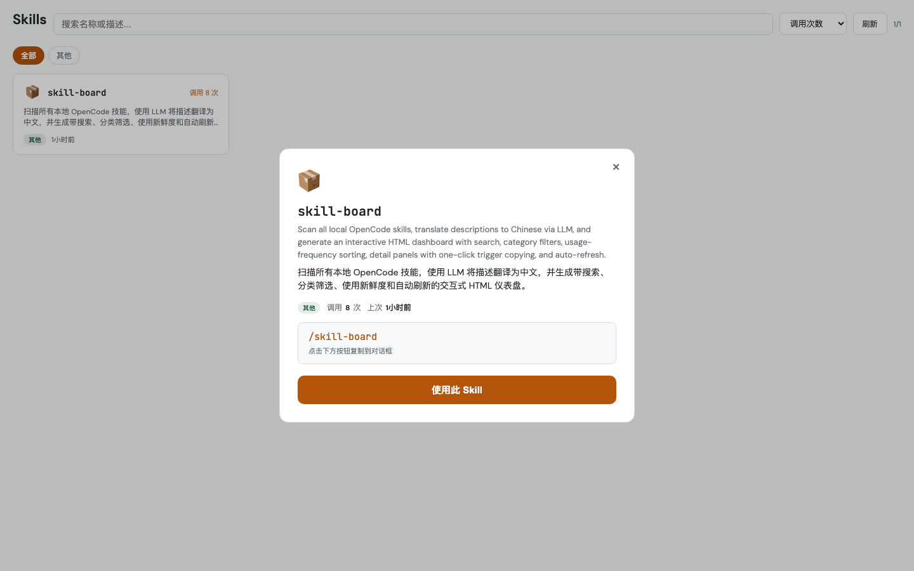

# skill-board

[中文说明](./README.zh-CN.md)

A productized dashboard for OpenCode skills. It scans local `SKILL.md` files,
translates descriptions, tracks usage frequency, and helps teams discover and invoke
the right skill fast.

## Preview




## Why skill-board

- **Discover faster**: one board for all installed skills
- **Understand quickly**: Chinese descriptions + usage examples
- **Prioritize what matters**: usage-based sorting
- **Invoke instantly**: copy `/skill-name` in one click

## Features

- Skill auto-discovery from `~/.config/opencode/skills/*/SKILL.md`
- Frontmatter parser for `name` and `description`
- LLM translation pipeline with cache (`data/translations.json`)
- Usage analytics from telemetry + local logs
- Search/filter/sort UI for high-speed navigation
- Detail panel with command + suggested prompt example
- Local API endpoint (`POST /api/use`) for intent tracking
- Auto refresh (5 min) + manual refresh feedback
- System-aware dark/light theme

## Project Structure

```text
skill-board/
  SKILL.md                 # Skill definition for OpenCode
  scripts/
    generate.ts            # Scan/translate/classify/generate
    serve.ts               # Local static server + /api/use logging
  data/
    translations.json      # Translation cache
    skill-data.json        # Generated skill data
    dashboard.html         # Generated dashboard
    usage-log.jsonl        # Local usage log
```

## Installation

### Requirements

- macOS or Linux
- [Bun](https://bun.sh/)
- OpenCode skill environment

### Local setup

```bash
git clone https://github.com/martinldh/skill-board.git
cd skill-board
```

## Quick Start

### 1) Generate dashboard data and HTML

```bash
bun run scripts/generate.ts
```

### 2) Start local server

```bash
bun run scripts/serve.ts
```

### 3) Open dashboard

```bash
open http://localhost:4173
```

## Product Workflow

1. Scan skill metadata
2. Translate descriptions (cache-first)
3. Merge usage signals
4. Generate static dashboard artifacts
5. Serve locally and interact

## Use in OpenCode

Trigger directly:

```text
/skill-board
```

The skill workflow will:

1. Regenerate dashboard
2. Start/restart local server
3. Open dashboard in browser
4. Bring Chrome to foreground

## Common Use Cases

- New team member onboarding for internal skills
- Weekly cleanup of low-value or duplicated skills
- Finding the right tool for QA / docs / release workflows
- Identifying high-frequency skills for deeper investment

## Category Rules

| Category | Matches |
| --- | --- |
| Testing | `playwright*`, `qa`, `test*`, `browse` |
| Documentation | `docx`, `pdf`, `pptx`, `document-*`, `make-pdf` |
| Dev Tools | `python-*`, `git*`, `ship`, `review`, `*-dev` |
| AI/Planning | `claude`, `plan-*`, `gbrain`, `office-hours` |
| Design | `design-*`, `browse` |
| Operations | `cso`, `health`, `benchmark`, `canary`, `freeze`, `guard` |
| Other | everything else |

## FAQ

### Why don't I see updated cards after editing SKILL.md?

Regenerate first:

```bash
bun run scripts/generate.ts
```

Then refresh the browser or click the dashboard refresh button.

### Why is usage count zero?

`skill-board` merges both:

- `~/.gstack/analytics/skill-usage.jsonl`
- `data/usage-log.jsonl`

If telemetry is off, local log still works.

### Can I use it without OpenCode?

Yes. You can run `generate.ts` and `serve.ts` directly with Bun.

## Troubleshooting

### Port 4173 is occupied

```bash
kill $(lsof -ti:4173) 2>/dev/null || true
```

### `bun` command not found

Install Bun from https://bun.sh and retry.

### Browser does not come to front

Run:

```bash
osascript -e 'tell application "Google Chrome" to activate'
```

## Roadmap

- Custom category rules via config file
- Multi-language UI support
- Better per-skill example prompt generation
- Export dashboard snapshot

## Contributing

Issues and PRs are welcome. Suggested contribution flow:

1. Fork repository
2. Create feature branch
3. Run and verify locally
4. Open PR with before/after screenshots

## License

MIT
